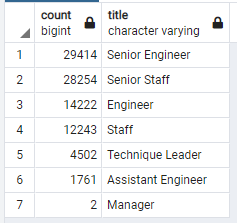
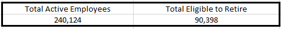
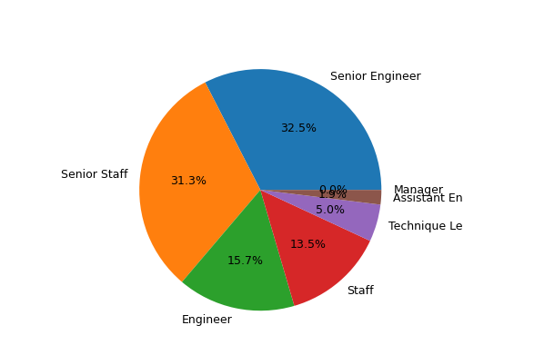
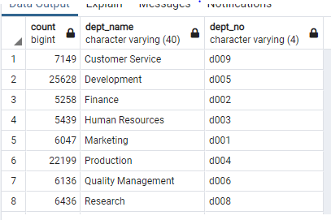
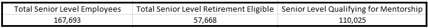

# Pewlett-Hackard-Analysis

## Overview of Project
The purpose of this project was to provide a query analysis to the HR department of the current active employees nearing retirement and active employees
who are eligible to participate in a mentorship program based on age.

## Results
The query results for retiring persons showed:
* 90,398 employees will be eligible for retirement

* Employees eligible for retirement equates to 37.64% of the workforce

		

* 63.8% of employees eligible for retirement are senior level staff.

* Only 1549 employees (less than 1%) qualify for the mentorship program.

## Summary

Over 90,000 positions will be retirement eligible and Pewlett Hackard will need to be strategic about filling positions.  It would be a good idea
to see if any particular department will be hit hard.  A query tying retirement eligible employees to departments would give you an idea of which departments 
will take the biggest hit.  Development and Production departments will take the biggest retirement hit.

There are only 1549 employees who qualify for the mentorship program given the criteria from HR that they have to be born in 1965.  
However, if you expand the criteria to senior level employees instead of age you would have a larger subset of mentors to work with.

